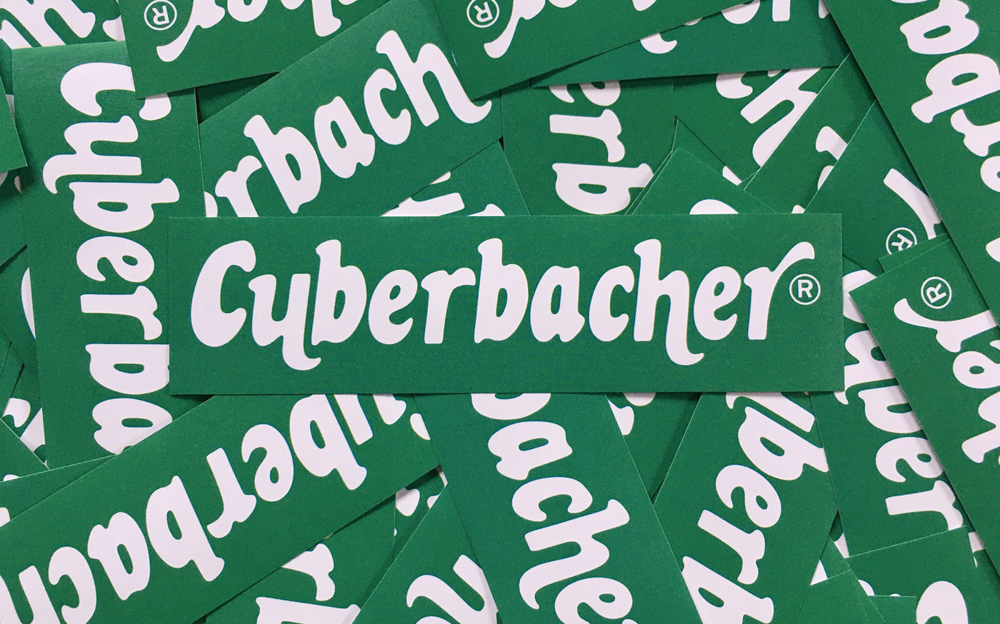

# Cyberbacher

> _"Cyberbacher Cybermüsli. Cybermüsli von Cyberbacher."_

I manually vectorized the logo of a known German cereal brand (notorious for their radio ads) and created the missing letters by hand. The green is just a guesstimate since I couldn't find any design documentation with color codes and they use completely different tones of green, even in digital media across their different social media profiles, for example.

The `cyberbacher_print_flyeralarm.pdf` is specifically created for printing stickers at Flyeralarm (hence the name). The file already includes their preferred color profile, the 4mm distance to the edge, and the 1mm bleed. The PDF has a size of 117mm\*32mm which will result in a final size of 115mm\*30mm.

If you plan to print at Flyeralarm, please check their current datasheet for stickers beforehand, to ensure they haven't changed their requirements in the meantime.

